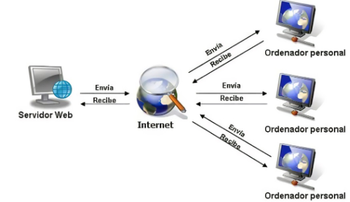

# Evaluación inicial

1. ¿Qué es una página web?

Es donde se muestra en un navegador la pagina realizada.


2. ¿Qué es un servidor web?

Es donde se almacena o se origina la pagina web y desde donde es publicada.


3. ¿Qué son los lenguajes de marcas? ¿Cuántos conoces?

Es un tipo de lenguaje el cual proporciona una serie de etiquetas para darle una estructura o formato al texto.
Ahora mismo, solo conozco Markdown y HTML.


4. ¿Qué es ```HTML```? ¿Sabes cómo se estructura?

Es un lenguaje de marcas que se utiliza para la creación de código para plasmarlo en una pagina.

```html
<!DOCTYPE html>
<html lang="en">
<head>
    <meta charset="UTF-8">
    <meta name="viewport" content="width=device-width, initial-scale=1.0">
    <title>Document</title>
</head>
<body>
    
</body>
</html>
```
**_Figura 1: Estructura de código HTML_**

5. ¿Qué es ```CSS```?

Es una hoja de estilos que se utiliza para dar un estilo (color, tamaño...) es decir, modificar el código.


6. ¿Sabes cómo funciona un navegador web? Describe brevemente el proceso que se sigue para visualizar una página web.:

Principalmente, tendremos que ir al navegador, en el mismo, escribiremos la URL del sitio y veremos la página. 




**_Figura 2: Esquema de peticiones HTML_**